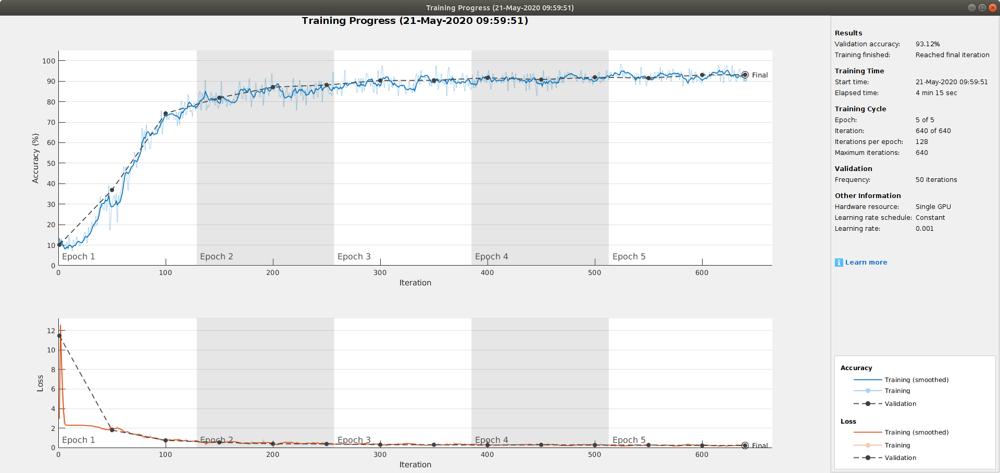
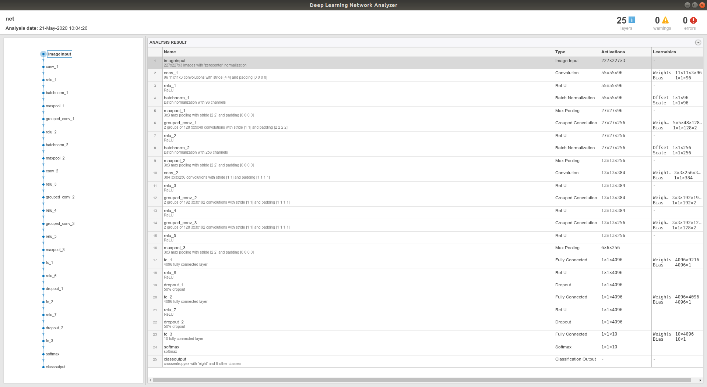
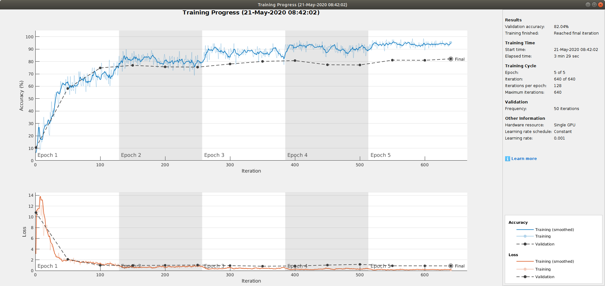
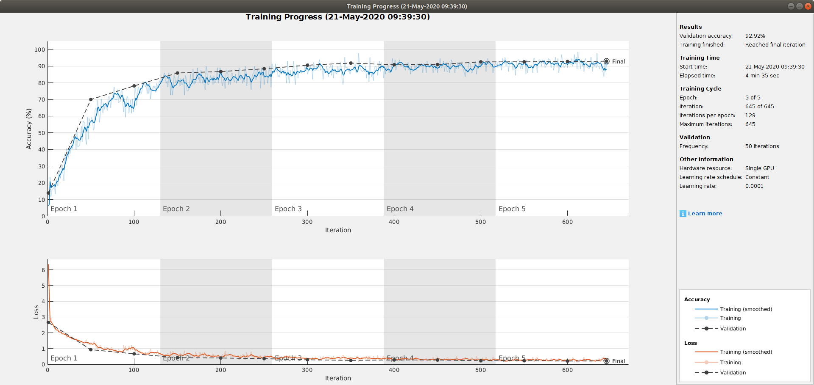

# CNN-SpokenDigits-Images
MelSpectrogram Classifications of Spoken Digits

This is an update of the results - gained roughly 10% after modifying the network's architecture

This is the newer version of the network's architecture, modeled after AlexNet's architecture

This is the first results of the classification task 

This is the latest results using AlexNet Transfer Learning
